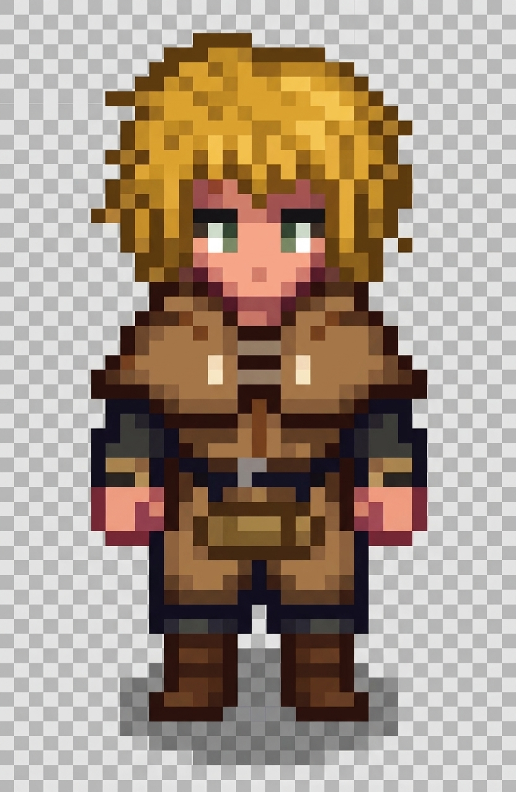
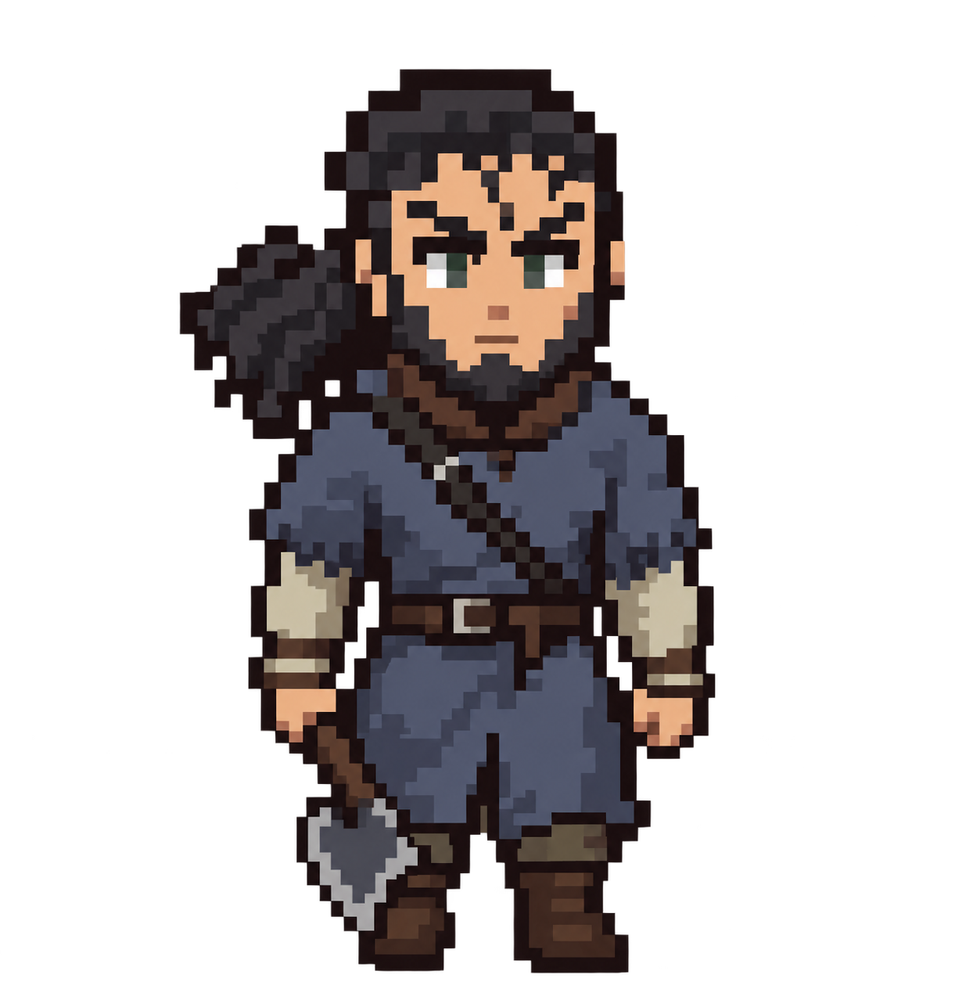
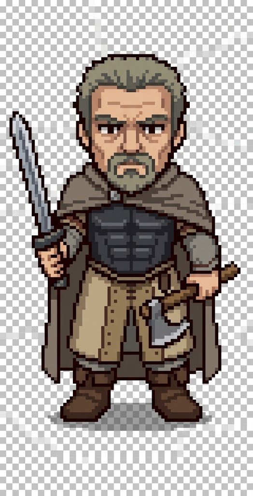
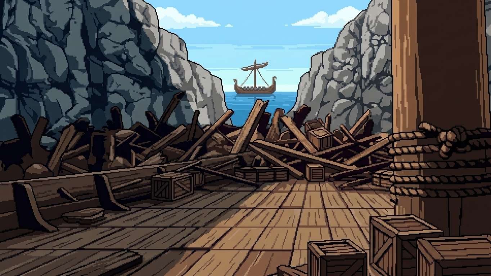
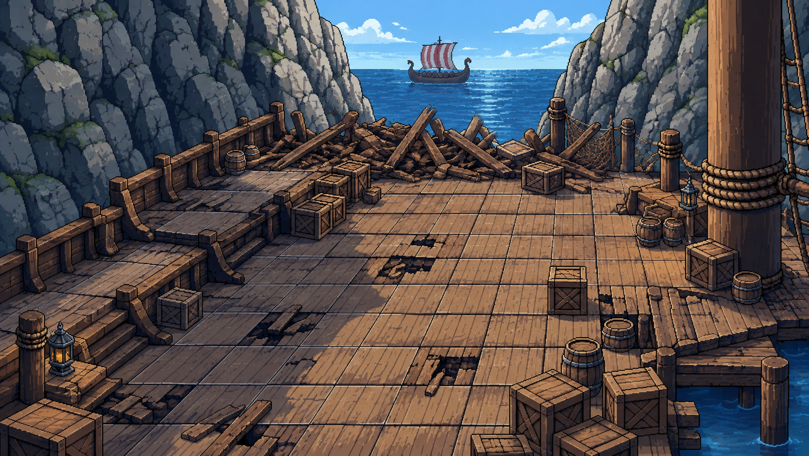
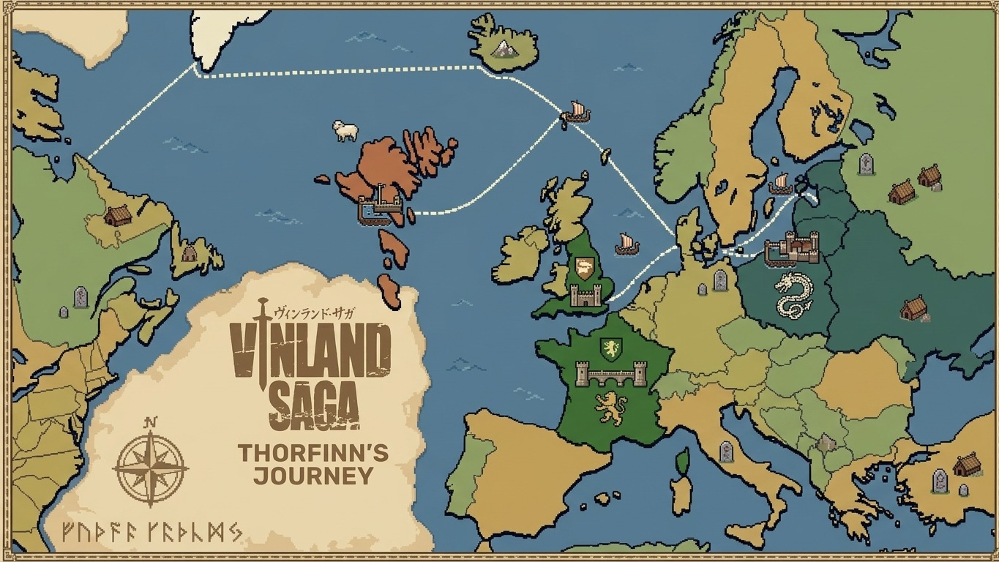

# Game Design Document — *Saga do Norte* (nome provisório)

**Versão:** v0.2 — Direção Visual e Level Design
**Data:** 10/09
**Disciplina:** Projeto de Jogos Digitais I — Desenvolvimento de um Jogo 2D com Unity

---

## 1. Equipe e Papéis

| Nome | Papel |
|---|---|
| João Pedro Bezerra Silva | Artista 2D + Animador / Game Designer + Producer |
| Adan Crystian | Programador + Sound Designer |
| Bryan Rongelli | Level Designer |
| Tatiane Oliveira | QA |

---

## 2. Nome Provisório e Gênero

**Nome provisório:** Saga do Norte
**Gênero:** Estratégia por turnos / Conquista territorial, com viés narrativo

**Nota de licenciamento:** o professor responsável pela disciplina autorizou o uso direto de personagens, nomes e enredo de *Vinland Saga* (Makoto Yukimura / Wit Studio), visto que o projeto é acadêmico e não possui fins lucrativos.

---

## 3. High Concept

Em uma terra nórdica fragmentada por clãs em guerra, o jogador acompanha a jornada de Thorfinn — desde a perda de seu pai, Thors, até sua ascensão como guerreiro sob o comando de Askeladd — conquistando territórios em batalhas táticas por turno enquanto revive os principais eventos da saga.

---

## 4. Público e Plataforma-Alvo

- **Público:** Jogadores casuais e fãs de estratégia leve, incluindo fãs de Vinland Saga
- **Plataforma:** PC (Windows)
- **Classificação:** Livre, com violência estilizada (pixel art)

---

## 5. Objetivo do Jogador

Conduzir Thorfinn (e, no prólogo, Thors) através de batalhas táticas por turno, conquistando territórios ligados à jornada da obra, até o confronto final na Inglaterra.

---

## 6. Mecânica Principal

Combate tático por turnos em grade (grid), com:
- Posicionamento de unidades
- Unidades com atributos e classes distintas
- Terreno e obstáculos (destroços, caixas, barris) influenciando o combate

---

## 7. Mecânicas Secundárias

- Mapa estratégico de conquista de territórios, com ordem fixa de progressão
- Progressão do grupo (unidades ganham experiência e upgrades)
- Recursos obtidos por território conquistado
- **Cutscenes narrativas pós-batalha:** eventos-chave da história (derrotas e mortes canônicas) são resolvidos via cutscene, não alterando o resultado mecânico da batalha (ver seção 9)

---

## 8. Core Loop

1. Selecionar território alvo no mapa estratégico
2. Batalha tática por turnos
3. Vitória → conquista do território (e recursos) + possível cutscene narrativa
4. Uso dos recursos para fortalecer o grupo
5. Repetir até dominar todos os territórios

---

## 9. Estrutura de Fases e Progressão de Dificuldade

| Ordem | Fase / Território | Unidade jogável | Dificuldade | Contexto narrativo (referência: anime, T1) |
|---|---|---|---|---|
| Prólogo | Ilhas Faroé — emboscada | **Thors** | Introdutória / tutorial | Baseado no Ep. 4 — Thors enfrenta o bando de Askeladd. Jogador vence a batalha, mas uma cutscene mostra a traição e morte de Thors, fiel à história |
| 1 | Ilhas Faroé — arco principal | Thorfinn | Fácil | Baseado no Ep. 14 ("The Light of Dawn") — duelo de Thorfinn contra Askeladd. Jogador vence a batalha, cutscene mostra Thorfinn sendo dominado e forçado a entrar no bando |
| 2 | Jomsburg | Thorfinn (+ Askeladd, se viável no escopo) | Média | Contexto de background — fortaleza dos Jomsvikings, ligada ao passado de Thors como guerreiro lendário |
| 3 | Inglaterra (Ponte de Londres) | Thorfinn (+ grupo) | Difícil (clímax da versão atual) | Baseado no arco de outubro de 1013 — invasão liderada pelo Rei Sweyn Forkbeard, bando de Askeladd contratado como mercenário |

**Decisão de design — cutscenes de derrota narrativa:** em pontos-chave da história onde o protagonista (Thors ou Thorfinn) é derrotado no anime, o jogador vence a batalha normalmente no gameplay. Em seguida, uma cutscene curta (imagem estática + diálogo) narra a reviravolta/traição que resulta na derrota canônica, preservando a fidelidade à obra sem impor uma derrota mecânica ao jogador.

**Decisão em aberto:** se Askeladd se tornará unidade jogável após a Fase 1, aproveitando o sprite de inimigo já produzido (economia de escopo). A decidir conforme andamento do cronograma.

---

## 10. Condições de Vitória e Derrota

- **Vitória (por batalha):** eliminar todas as unidades inimigas ou cumprir objetivo específico da fase
- **Vitória (geral):** conquistar todos os territórios previstos
- **Derrota:** perder todas as unidades do grupo em uma batalha

---

## 11. Personagens

**Estilo visual definido:** Pixel Art 16-bit, visão top-down (3/4), proporções chibi (2 a 2,5 cabeças de altura), grid compacto (16x32 ou 32x32 px), contornos escuros bem marcados, sombreamento em blocos (2-3 tons por elemento). Referências: Stardew Valley, Harvest Moon, RPGs da era SNES.

### Thorfinn

**Papel no jogo:** Protagonista jogável (Fases 1, 2 e 3)
**Arma:** Adagas
**Arquétipo de combate:** Duelista ágil, foco em velocidade e ataques diretos

Jovem guerreiro islandês, filho de Thors. Após testemunhar a morte do pai, dedica sua juventude à busca por vingança contra Askeladd, ingressando no bando de mercenários dele. Ao longo da jornada, é confrontado com questões de honra e o real significado de ser um guerreiro.

### Thors

**Papel no jogo:** Jogável apenas no Prólogo (Ilhas Faroé)
**Arma:** Machado de batalha
**Arquétipo de combate:** Guerreiro pesado, alto poder de combate, unidade tutorial

Pai de Thorfinn e ex-guerreiro lendário, conhecido em seu passado como "o Troll de Jomsburg". Na história atual, vive como fazendeiro pacífico na Islândia e acredita que "nenhum homem tem inimigos". Sua morte na emboscada das Ilhas Faroé é o evento que desencadeia toda a jornada de vingança de Thorfinn.

### Askeladd

**Papel no jogo:** Antagonista da Fase 1 (possível unidade jogável a partir da Fase 2, a confirmar)
**Arma:** Espada e machado
**Arquétipo de combate:** Estrategista astuto, mais dependente de tática do que força bruta

Líder de um bando de mercenários vikings, responsável pela morte de Thors. Figura moralmente ambígua — astuto, calculista, e recorrentemente mostrado como um mentor involuntário de Thorfinn ao longo da jornada, apesar de ser seu alvo de vingança.

---

## 12. Planejamento de Animações

| Estado | Thorfinn | Thors | Askeladd | Unidades genéricas |
|---|---|---|---|---|
| Idle | ✅ | ✅ | ✅ | ✅ |
| Walk | ✅ | ✅ | ✅ | ✅ |
| Attack | ✅ | ✅ | ✅ | ✅ |
| Hit / Hurt | ✅ | ✅ | ✅ | ✅ |
| Death | ✅ | ✅ | ✅ | ✅ |
| Victory (opcional) | ✅ | — | — | — |

---

## 13. Concept de Cenário

**Cenário do Prólogo (Ilhas Faroé — doca/cais):**

**Arte de cutscene** (perspectiva cinematográfica, usada na cena de abertura/emboscada):

**Battle stage** (tabuleiro tático, visão top-down/isométrica baixa, grid de combate visível):

Penhascos rochosos emolduram uma doca de madeira parcialmente destruída, com destroços, caixas e barris funcionando como obstáculos de terreno na versão tática. Navio viking visível ao fundo em ambas as versões.

Cenários dos territórios de Jomsburg e Inglaterra: a produzir na próxima etapa.

---

## 14. Mapa Estratégico

Mapa de conquista territorial estilizado em pixel art, no formato de "mapa de campanha" (referência visual: mapas de Fire Emblem / Total War), baseado na geografia real da jornada de Thorfinn na obra. Destaca visualmente os 3 territórios jogáveis (Ilhas Faroé, Jomsburg, Inglaterra) com indicação de ordem de conquista, mantendo o restante do mapa-múndi como pano de fundo narrativo não-interativo.

*Status: em ajuste final (correção de destaque visual dos territórios jogáveis — versão exibida ainda não reflete o destaque final).*

---

## 15. Referências

- **Obra-base:** Vinland Saga (mangá de Makoto Yukimura; anime por Wit Studio/MAPPA) — uso autorizado pelo professor da disciplina, projeto sem fins lucrativos
- **Combate tático:** Fire Emblem, Into the Breach
- **Conquista territorial:** Crusader Kings, Total War (versão simplificada)
- **Estilo de sprite:** Stardew Valley, RPGs SNES

---

## 16. Escopo Atual

- 1 mapa estratégico com 3 territórios (Ilhas Faroé, Jomsburg, Inglaterra) + 1 fase de prólogo
- 1 tipo de battle stage por território (grid tático simples com obstáculos)
- Unidades jogáveis: Thorfinn (principal), Thors (prólogo), Askeladd (em avaliação)
- Sem sistema de diplomacia complexo nesta fase
- Foco em ter o core loop jogável e polido antes de expandir conteúdo

---

## 17. Repositório do Projeto

- Repositório: `github.com/jpbezerra9/saga-do-norte`
- Tag desta entrega: **v0.2**
- Estrutura de pastas mantida conforme v0.1 (`/GDD`, `/UnityProject`, `/Art`, `/Animation`, `/Audio`, `/LevelDesign`, `/QA`)

---

*Documento vivo — será atualizado a cada entrega conforme o desenvolvimento avança.*
